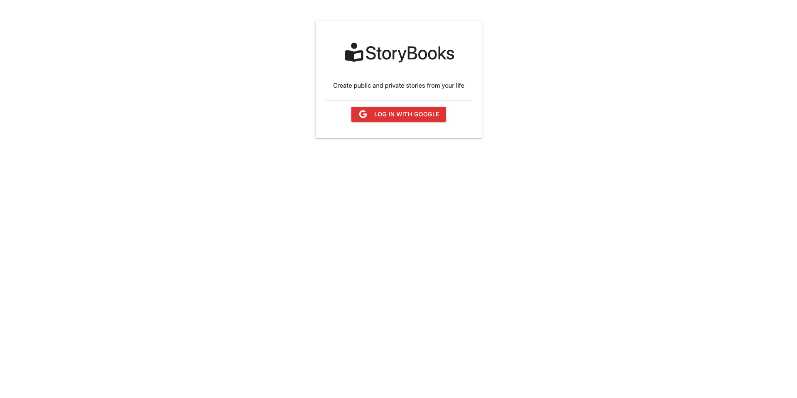

# StoryBooks

A full-stack storytelling app where users can create, edit, and share stories with others. Users can log in with Google, manage their own stories through a dashboard, and choose whether stories are public or private.

🚧 **Live Demo: Coming Soon**

---

## How It's Made:

**Tech used:** HTML, CSS, JavaScript, Node.js, Express.js, MongoDB, Mongoose, Passport.js, Google OAuth, Handlebars, Materialize CSS

StoryBooks was built using the MVC pattern to keep the project organized and easier to scale. I used Node.js and Express to handle the backend and routing, while MongoDB stores user and story data. Users can securely sign in using Google OAuth with Passport.js authentication.

On the front end, I used Handlebars for rendering pages and Materialize CSS for styling and responsiveness. Users can create, edit, delete, and view stories, while public stories are displayed in a shared feed for everyone to read.

One of the main goals of this project was learning how a full-stack application works from front to back. Building StoryBooks helped me better understand routing, middleware, authentication, CRUD functionality, and how data moves between the client, server, and database.

---

## Data Flow

When a user logs in with Google, Passport.js authenticates the user and creates a session. Protected routes check if a user is logged in before allowing access to dashboards or story management pages.

When a story is created:

1. The user submits a form.
2. A POST request is sent to the server.
3. The controller handles the request and saves the story to MongoDB.
4. The story is connected to the logged-in user.
5. The user is redirected back to their dashboard.

Public stories are fetched from the database and displayed in order from newest to oldest.

---

## Optimizations

As the project grew, I cleaned up repeated logic by moving authentication and route protection into reusable middleware files. I also improved database queries using Mongoose methods like `.populate()` and sorting stories by creation date for a better user experience.

Organizing the project into MVC folders also made the application easier to debug and maintain as more features were added.

---

## Lessons Learned

This project taught me a lot about how full-stack applications are built and structured. Before this project, concepts like OAuth, sessions, middleware, and MVC architecture felt confusing, but building StoryBooks helped those ideas click for me.

I also learned how important debugging and reading documentation are during development. I ran into issues with MongoDB connections, Passport configuration, and rendering data, but solving those problems helped me become more confident working through errors on my own.

Overall, this project gave me a much better understanding of how the frontend, backend, and database all work together in a real-world application.